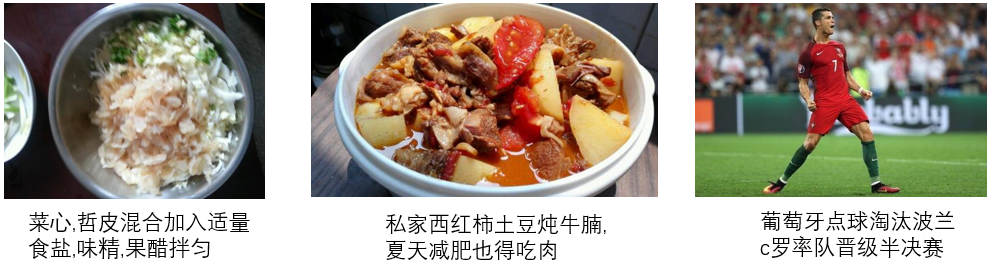
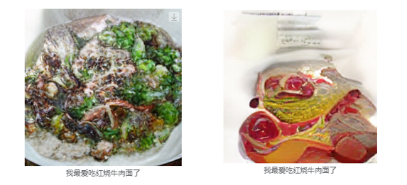

# text2img

### 项目描述

模式识别课设代码：

- 基于Wukong中文开源数据集，进行CLIP图文检索模型、VQVAE图像编解码模型训练，VQVAE+VQGAN、VQGAN+DALLE图像生成模型训练，开源中文图文检索模型BriVL与自训CLIP性能比较。
- 最后使用VQGAN的进行DALLE模型训练，实现了食物领域的文本生成图像，并使用BriVL重排生成结果。

### 环境依赖

- 主要基于pytorch环境
- 具体环境依赖参考各个项目下的README

### 目录结构 & 重要代码文件

```
│  README.md
│  dalle_gen.py  调用训练得到的DALLE模型，指定文本生成对应图像
│  clip_sort.py  调用BriVL对生成结果进行rerank
├─form_data
│  ├─dealData_wukong.ipynb  对wukong原始数据的下载、清洗以及划分train&val
│  └─foodNames.txt  食物关键词，用于从wukong数据中筛选食物相关的图文对
├─open_clip   CLIP模型训练项目
├─BriVL-code-inference  BriVL模型推理代码
│  
└─DALLE-pytorch  VQVAE模型训练 DALLE模型训练

```

### 运行

- 训练CLIP模型

  ```
  cd open_clip
  nohup python  -u  -m torch.distributed.launch --nproc_per_node=4  src/training/main.py \
    --save-frequency 10 \
    --report-to wandb \
    --train-data="../train_clean.csv"  \  
    --val-data="../val_clean.csv"  \
    --csv-img-key filepath \
    --csv-caption-key title \
    --batch-size=64 \
    --lr=1e-4 \
    --wd=0.1 \
    --epochs=30 \
    --workers=4 \
    --horovod  \
    --model RN50 >log 2>&1 &
  ```

- 训练VQVAE模型
  
  ```
  cd DALLE-pytorch
  nohup python -u train_vae.py \
    --image_folder=训练所用存放图像文件的目录 \
    --batch_size=64 \
    --num_layers=4 \
    --num_tokens=1024 \
    --emb_dim=256 \
    --image_size=256 >vae.log 2>&1 &
  ```

- 训练DALLE模型

  ```
  cd DALLE-pytorch
  nohup python -u train_dalle.py
    --image_text_folder=./DALLE.train.jsonl
    --vae_path= 训练得到的VQVAE模型位置 
    --chinese 
    --amp 
    --dalle_output_file_name=vae_dalle >dalle.log 2>&1 &
  ```

- 使用BriVL进行推理

  ```
  更新BriVL-code-inference/cfg/test_xyb.yml中的JSONPATH
  cd BriVL-code-inference/evaluation
  sh evaluation.sh
  ```

- 使用DALLE生成图像&BriVL推理

  ```
  python dalle_gen.py [text] [img_num] [save_path]
    基于句子生成图像

  python clip_sort.py [text] [img_num] [save_path]
    基于句子和图像计算相似度，输出排序后结果
  
  parameter：
    text：输入食物相关的句子，长度最好大于10
    img_num：生成图像数量
    save_path：图像保存地址
  ```

### 实验过程

> 下面所给图像均是截图，非原始生成图像

#### **数据预测处理**

数据集：WuKong 华为诺亚开源的中文图文数据集，其中包含一亿个来自网络的中文图文对。

出于训练收敛速度的考虑，我们限定了本实验所用的图片域，通过词表筛选图像caption中的关键词，挑选出食物相关的图片。此外，过滤caption长度大于32、包含特殊特殊字符的caption、image宽高比大于3以及image size过小的数据样本。

最终从WuKong数据集的前十个文件中（10/255，合计3.9M图文对）清洗得到51k样本；按9:1划分train-validation dataset，如下表：

| Type  | Size  |
| ----- | ----- |
| train | 45975 |
| val   | 5112  |

所得数据图文相关性整体较强，但图片范围不仅限于食物题材（如下右一图）。



#### **实验一：VQVAE+DALLE模型训练**

1. VQVAE训练结果

- Train on V100, 40min, resolution=128


- Train on V100, 36min, resolution=256


2. 基于VQVAE的DALLE模型训练结果
- 左边两张图为训练过程中原图以及基于图像caption的生成结果；右图为基于文本输入的生成结果


#### **实验二：开源VQGAN+DALLE模型训练**

训练结果

Train on V100, 25.37h, resolution=256（train loss未完全收敛）




#### **实验三：VQGAN+DALLE+BriVL**

输入文本：这一碗红烧牛肉面的肉好多，是真的好吃

- VQGAN+DALLE  Random 4


- VQGAN+DALLE+BriVL  Top 4


### 相关资源

- wukong数据集：https://wukong-dataset.github.io/wukong-dataset/benchmark.html
- 使用的开源预训练VQGAN：https://heibox.uni-heidelberg.de/f/140747ba53464f49b476/?dl=1
- 中文文本tokenizer：https://huggingface.co/hfl/chinese-roberta-wwm-ext

### 参考项目

- https://github.com/mlfoundations/open_clip
- https://github.com/BAAI-WuDao/BriVL
- https://github.com/lucidrains/DALLE-pytorch